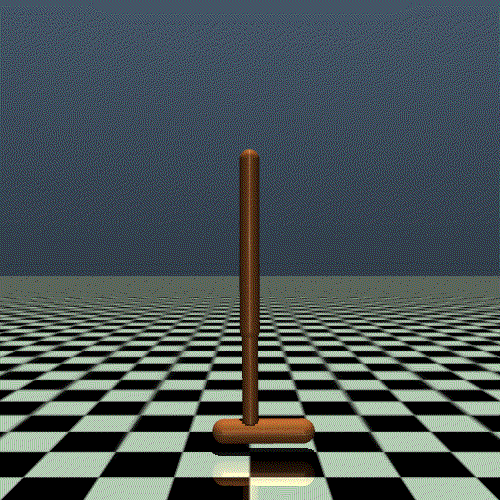

# RL‑MLDL‑25

<table cellpadding="0" cellspacing="0">
  <tr>
    <td align="center" valign="middle">
      
    </td>
  </tr>
</table>


**Reinforcement Learning with Domain Randomization and SimOpt: a comparison between optimizers and discrepancy functions**

A compact research framework to **train, evaluate and analyse** policy‑gradient agents on the (custom) *Hopper* task, study the impact of **Uniform Domain Randomization (UDR)** and compare several flavours of **SimOpt adaptive randomization** (CMA‑ES, PSO, DE) with various metrics.

Everything is orchestrated by a single launcher, `main.py`, so reproducing the paper’s results is a one‑liner.

---

## Features

* PPO, REINFORCE (also with 2 different baselines) and Actor‑Critic algorithms
* Plug‑and‑play UDR on thigh/leg/foot masses
* Hyper‑parameter sweeps for PPO and UDR bounds
* Adaptive SimOpt training with three evolutionary optimisers and three trajectory‑discrepancy metrics
* End‑to‑end testing pipeline that builds the full source→source / source→target / target→target transfer matrix
* Automatic logging of checkpoints (`models_weights/`) and per‑episode returns (`models_data/`)
* Ready‑made Jupyter notebook for plotting and statistical analysis

---

## Run the code

We suggest to use `colab_starting_code.ipynb/` (contained in this repo) on Google Colab. 

---

## Project layout

```
agentsandpolicies/     ← algorithms: REINFORCE, Actor‑Critic, PPO with and without UDR, PPO with SimOpt 
env/                   ← Custom Hopper environment
tuning/                ← grid‑search scripts for PPO and UDR
models_weights/        ← saved checkpoints (auto‑created)
models_data/           ← CSV logs (auto‑created) and notebook for analysis
main.py                ← pipeline launcher (entry point)
```

---

## Typical recipes 

### 1. Baseline policy‑gradient agents

| Goal                                                  | Command                                                                          |
| ----------------------------------------------------- | -------------------------------------------------------------------------------- |
| **Train REINFORCE (vanilla)** – 100 k episodes on GPU | `!python3.8 main.py --run_training --agent REINFORCE --episodes 100000`          |
| **Train REINFORCE\_BAVG** (AVG‑baseline)             | `!python3.8 main.py --run_training --agent REINFORCE_BAVG --episodes 100000`      |
| **Train REINFORCE\_BVAL** (value net‑baseline)            | `!python3.8 main.py --run_training --agent REINFORCE_BVAL --episodes 100000` |
| **Train Actor‑Critic**                                | `!python3.8 main.py --run_training --agent ActorCritic --episodes 100000`        |

### 2. Hyper‑parameter sweeps

| Goal                                            | Command                           |
| ----------------------------------------------- | --------------------------------- |
| **PPO grid search** (learning‑rate, γ) 		  | `!python3.8 main.py --ppo_tuning` |
| **UDR mass sweep** (uses best PPO params)       | `!python3.8 main.py --udr_tuning` |

### 3. PPO training

| Goal                                              | Command                                                                                                |
| ------------------------------------------------- | ------------------------------------------------------------------------------------------------------ |
| **Baseline PPO (no UDR) on *target*** – 2 M steps | `!python3.8 main.py --run_training --agent PPO --env source --episodes 2000000 --device cpu`           |
| **PPO + UDR on *source*** – 2 M steps             | `!python3.8 main.py --run_training --agent PPO --use-udr --env source --episodes 2000000 --device cpu` |
| **PPO + SimOpt** (CMA‑ES, 100 k final steps)      | `!python3.8 main.py --simopt_train --simopt_optimizer cma --final_steps 100000`                        |

### 4. Evaluation & benchmarking

| Goal                                                  | Command                                                                    			   |
| ----------------------------------------------------- | ---------------------------------------------------------------------------------------- |
| **Full transfer matrix** S→S / S→T / T→T (UDR off/on) | `!python3.8 main.py --run_testing --agent PPO --all-testing --episodes 100 --device cpu` |


*Use `--seed` and `--device` to override defaults if needed.*


---

## Authors

<table cellpadding="0" cellspacing="0">
  <tr>
    <td align="left" valign="middle">
      – Emanuele Francesco Elias s344489<br>
      – Dalia Lemmi s344440
    </td>
    <td align="right" valign="middle">
      
    </td>
  </tr>
</table>


